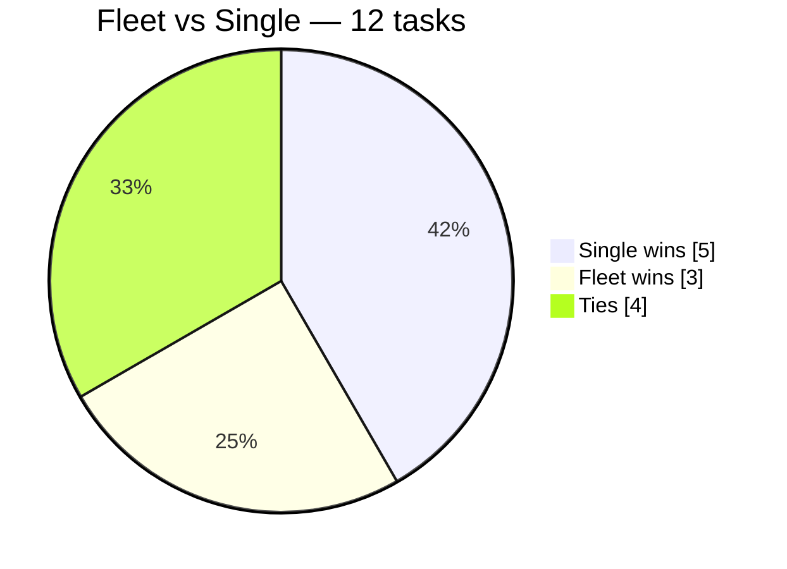

# Prism — Evaluation Report

*Does fanning one model into a "fleet" of lenses actually beat one careful pass?
We measured it. Here's what we found.*

> **Headline:** Over a 12-task battery of real design questions, a **single careful Opus pass
> beat the 8-lens fleet 5–3 (4 ties)** at **~4.6× lower token cost.** On open-ended design work
> the fleet did **not** earn its cost. Its one real edge showed up elsewhere: **finding concrete,
> cited defects** — all 3 fleet wins were defect catches. Verdict: *shrink the default; reserve
> the fleet for defect-finding.* Honest caveats below bound this result to "shrink-leaning, not
> proven."

---

## 1. Why we ran this

Prism's whole premise is one unproven bet: that **fan-out → judge → adversarial-verify → loop**
produces better answers than asking a strong model once. Most "multi-agent" tools never test that
bet. Prism ships a harness (`/prism-eval`) designed to test it honestly — and, critically, to be
*able to conclude "shrink the default — the smaller config wins."* This report is the first real run.

**The one rule throughout: no fabrication.** Every number below comes from a sub-agent actually
executed in the session (~110 of them); token figures are each agent's reported `subagent_tokens`.
Anything not run is marked `NOT RUN`.

---

## 2. What we tested

```mermaid
flowchart LR
    T["12 real design tasks<br/>(Prism's own internals)"] --> F["FLEET<br/>6 Opus lenses (differential)<br/>→ orchestrator synthesis"]
    T --> S["SINGLE<br/>1 careful Opus pass<br/>(no fan-out)"]
    F --> J{"Blind Sonnet judge<br/>labels stripped · order alternated<br/>'ignore length'"}
    S --> J
    J --> R["win / loss / tie<br/>+ token cost per side"]
    R --> A["Aggregate: win-rate,<br/>Wilson 95% CI, token multiple"]
    classDef f fill:#ebfbee,stroke:#2f9e44; classDef s fill:#e7f5ff,stroke:#1971c2; classDef j fill:#fff9db,stroke:#e8590c;
    class F f; class S s; class J j;
```

Three measurements were attempted:

| Test | What it measures | Status |
|---|---|---|
| **Fleet vs single (blind A/B)** | Does the fleet's answer beat one careful pass? | **RUN — 12 tasks** |
| **Grounding precision/recall** | Does the verifier catch false/stale code claims? | **RUN — 1 fixture** |
| **Injected-flaw detection** | Does the panel catch a planted bug? | **RUN — 1 fixture (pilot)** |
| Divergence-threshold calibration | The cosmetic-diversity cutoff | `NOT RUN` (data too thin) |
| Find-the-floor (2/4/8-lens sweep) | Minimal config that still wins | `NOT RUN` (but see §4) |
| Does the Sonnet skeptic earn its slot | Cross-tier decorrelation value | `BLOCKED` (fixtures too easy) |

The 12 tasks were genuine design decisions about Prism itself (skeptic ratio, divergence weights,
memory pruning, branch policy, the `rm -rf` guard, telemetry storage, loop convergence, monorepo
detection, the eval judge, staging probes) — real trade-offs, no single obvious answer, grounded
in actual files. Full list: `eval/battery/battery.md`.

---

## 3. What we found

### 3.1 Fleet vs single — the headline



| Metric | Value |
|---|---|
| Record | **Fleet 3 · Single 5 · Tie 4** |
| Fleet win-rate (ties = 0.5) | **0.42** |
| Wilson 95% CI | **[0.19, 0.68]** — centered *below* 0.5 |
| Token multiple (fleet ÷ single) | **~4.6×** (≈5.5× incl. one runaway agent) |

The point estimate **favours the single pass.** Paying ~5× more produced an answer that lost more
often than it won.

> **The pilot lied.** A 4-task pilot first showed Fleet 3–0. It did not survive more data — a
> textbook small-sample fluke. This is exactly why the harness runs ≥12 and reports a CI.

### 3.2 The real pattern: the fleet's edge is *defect-finding*, not design quality

All **3 fleet wins** came from a single lens catching a concrete, cited defect the single pass
missed — including **real bugs in Prism's own files**:

- **Task 1:** the adversary lens caught a *math error in `prism.md`'s rationale* — it claims the
  lone Sonnet can be decisive "when both Opus miss," but under majority-of-3 that's impossible.
- **Task 4:** the safety lens found `prism-guard.sh:32` **doesn't block a local `git commit`** —
  so the branch step is the only thing keeping the agent off `main`.
- **Task 2:** the panel surfaced the divergence metric's *undefined-Jaccard hole* on design Qs.

But on open-ended design with no hidden defect, one coherent deep pass matched or beat six
fragmented briefs — and **twice the single pass found the bug the fleet missed** (the live
`rm -fr /` guard bypass; using divergence to tell *real* convergence from *lazy*).

**Conclusion: diversity helps when there's a concrete thing to catch. It doesn't add much to
open-ended reasoning, where it's outweighed by synthesis loss.**

### 3.3 Grounding precision/recall

The grounding verifier was fed 8 mixed claims (4 true, 4 injected-false) about a fixture file. It
**struck all 4 false and passed all 4 true → precision 1.00, recall 1.00.** Honest caveat: an easy
fixture (fabricated line numbers, obvious contradictions), n=8 — a ceiling result, not a hard test.

---

## 4. Caveats that bound this result *(read before sharing the number)*

This run is honest *because* it discloses what could be wrong with it:

1. **Synthesis was the bottleneck (biggest confound).** The "fleet answer" was a *hand-synthesis*
   of 6 briefs done inline under heavy multi-task load — and it had real defects (one task
   under-represented the fleet's majority; another carried a copy-paste typo). Some single "wins"
   reflect degraded synthesis, not the fleet method's ceiling. In a real Prism run the synthesis is
   a fresh focused pass. **This understates the fleet.**
2. **Domain confound.** All 12 are defect-free design questions. The fleet's measured strength
   (defect-finding) is under-represented, and codebase-spanning tasks — where differential context
   should help most — weren't tested.
3. **Verbosity.** Single passes were often longer/more thorough than the terser syntheses; even
   told to "ignore length," any residual bias favoured the single.
4. **Judge noise.** One Sonnet judge, n=1/task, no position-swap, no dual-judge.
5. **N=12.** The CI [0.19, 0.68] is wide.

Net: **shrink-leaning, not proven.** A stronger run needs a fixed (not hand-synthesised) fleet
output, position-swapped dual judges, and ≥25 tasks across more domains.

---

## 5. Recommendations

1. **Shrink the default fleet for open-ended design** — 8 lenses at ~5× cost didn't beat one
   careful pass. (This is the "find-the-floor" conclusion, reached via the full battery rather than
   a formal 2/4/8 sweep, which is `NOT RUN`.)
2. **Reserve the full fleet for defect-finding / code review**, where all 3 of its wins landed and
   where grounding + adversarial lenses have a concrete target.
3. **Fix the synthesis step first** — it was this experiment's true bottleneck and the cheapest
   quality lever.
4. **Harden the eval** before trusting any future win-rate: position-swap, dual/non-family judges,
   ≥25 tasks, and a real injected-defect battery so the Sonnet-skeptic slot can finally be tested.

---

## 6. Reproducibility & provenance

- **Battery:** `eval/battery/battery.md` (12 tasks)
- **Fixtures:** `eval/fixtures/` (grounding key + flaw-detection key)
- **Raw results:** `eval/results/2026-06-29-full-battery.md` (per-task winners + token counts),
  `eval/results/2026-06-29-pilot.md` (the 4-task pilot + grounding/flaw runs)
- **Method:** every fleet lens, single pass, and judge was a real sub-agent; token costs are their
  reported `subagent_tokens`. No metric was estimated, simulated, or inferred.

*Architecture of the system under test: see [`architecture.excalidraw`](architecture.excalidraw)
(editable, hand-drawn) and the Mermaid diagram in [`README.md`](README.md).*
